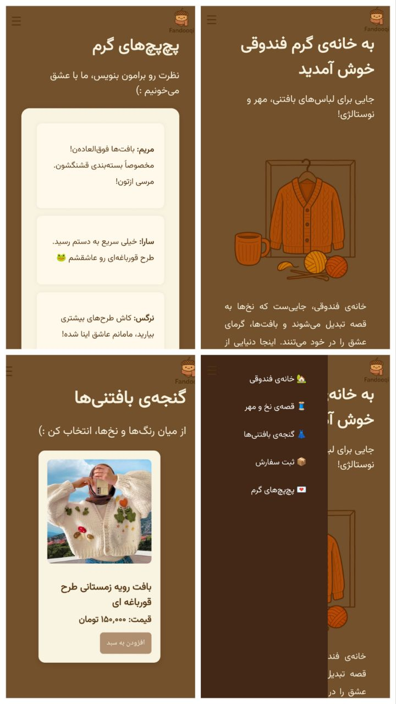

# 🧶 فندوقی | وب‌سایت فروش لباس‌های بافتنی(پروژه وب دانشجویی)

این پروژه یک وب‌سایت ساده و زیبای فروشگاه بافتنی است به زبان فارسی که با استفاده از HTML، CSS، و JavaScript طراحی شده است.وبه درد پروژه دانشجویی طراحی وب سایت فروشگاهی ساده درس آزمایشگاه زبان های برنامه نویسی میخورد

## ✨ امکانات پروژه:

- طراحی واکنش‌گرا (Responsive)
- گالری محصولات با لایت‌باکس
- افزودن به سبد خرید با LocalStorage
- فرم ثبت سفارش
- رابط کاربری شیرین و ساده

## 📁 صفحات پروژه:

- صفحه اصلی (index.html)
- درباره ما (about.html)
- محصولات (products.html)
- ثبت سفارش (order.html)
- پچ‌پچ‌های گرم (comments.html)
- 
## 🌐 مشاهده آنلاین
برای دیدن نسخه‌ی زنده و آنلاین سایت، روی لینک زیر کلیک کنید:
👇🏼👇🏼👇🏼

 **[مشاهده سایت Fandooghi](https://shabnamnoori.github.io/fandooghi/)**
 
 ## 🖼️ پیش‌نمایش سایت
 

  

## 👩‍💻 توسعه‌دهنده:  
[Shabnam Noori](https://github.com/Shabnamnoori)
